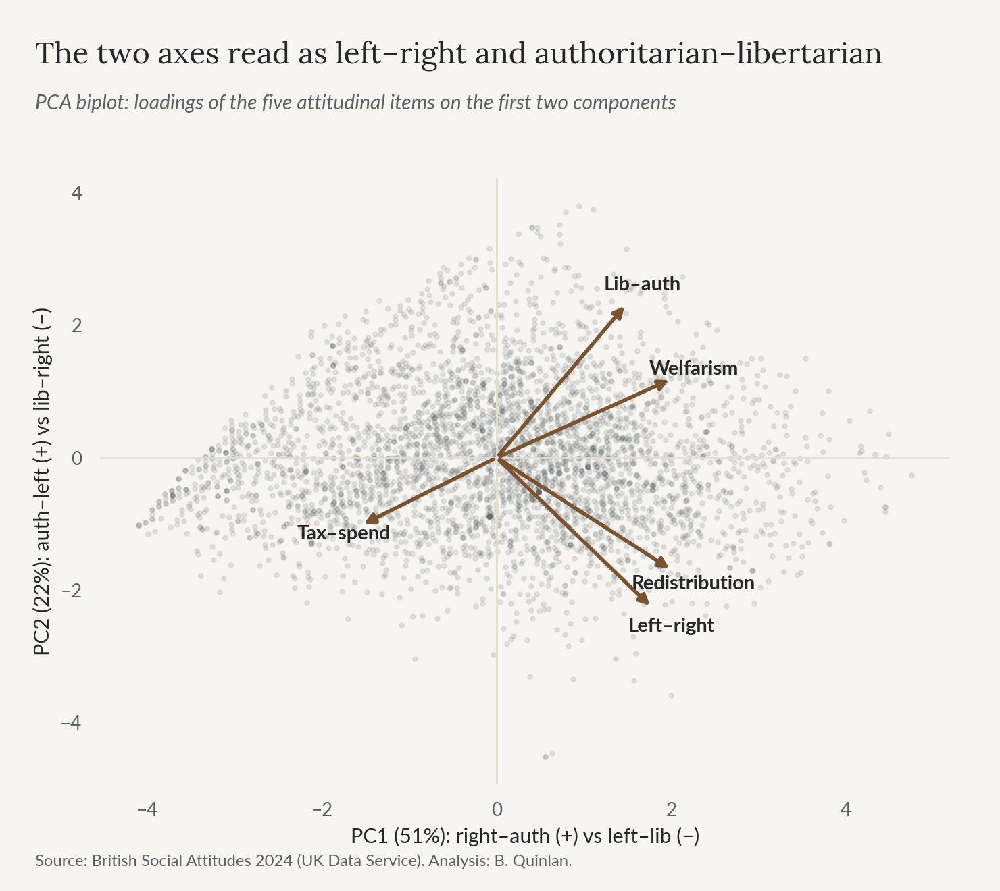
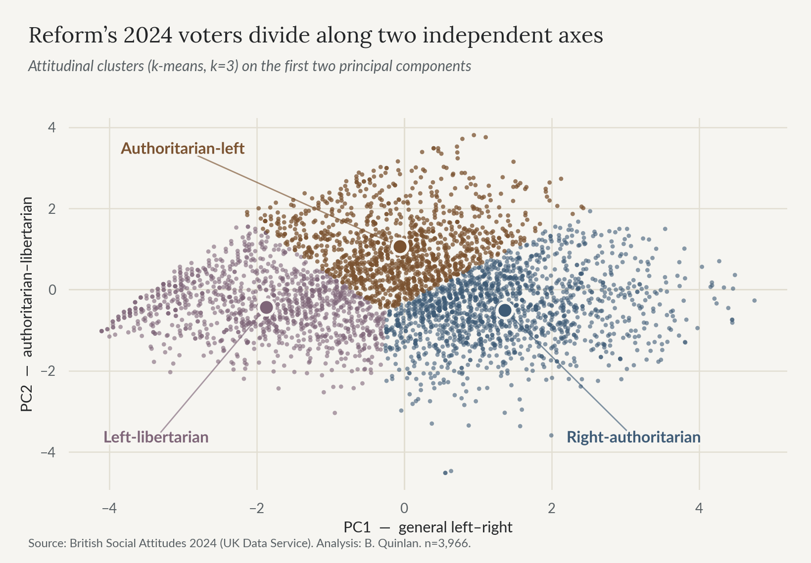

# One Coalition, Two Electorates: Cross-Pressure in the Reform UK Vote

**Bradley Quinlan**, 2026 · *Artificial Intelligence and Machine Learning with Applications*, University of Essex


[](https://github.com/BQ-Essex/reform-uk-two-electorates/actions/workflows/build-report.yml)

A multi-method, multi-dataset machine-learning study of whether Reform UK's 2024
electorate is a single bloc or several.

> **Headline finding:** clustered on political attitudes alone, Reform's 2024 voters
> split almost in half—**55%** in a conventional right-authoritarian group and
> **41%** in an **authoritarian-left** group that is pro-redistribution, left-leaning,
> and markedly the least credentialled of the three, sitting inside a party that campaigned on
> tax cuts it costed at **~£90bn a year**. Projected onto 2014 UKIP identifiers, the
> "left-behind" cluster is *larger* still (59%), so the pattern predates Reform by a decade.

## What's here

Everything in the repository, grouped by what it is for.

**The work**

| Path | What it is |
|------|-----------|
| [`notebook/`](notebook/) | The full analysis—code, narrative and figures inline. This is the primary artefact. |
| [`report/report.html`](report/) | The complete write-up rendered for reading, with the code kept in the notebook. |
| [`report/SUMMARY.md`](report/SUMMARY.md) | The code-free reader's version—the literature, the finding, and the limits, in plain language. |
| [`report/SUMMARY.html`](report/SUMMARY.html) | The same, generated from `SUMMARY.md` and styled to match the report. |
| `report/*.pdf` | Print versions of both, built from the HTML. |
| [`figures/`](figures/) | The eleven figures exported from the analysis. |
| [`data/`](data/) | The two open datasets, plus a README on obtaining the restricted survey data. |

**Building it** — you only need these to rebuild the documents from source; reading the report requires none of them.

| Path | What it is |
|------|-----------|
| `build_report.py` | Generates `report.html` from the notebook. |
| `build_summary.py` | Generates `SUMMARY.html` from `SUMMARY.md`. |
| `report_style.py` | The house stylesheet both builders import, so the two documents cannot drift apart. |
| `build_pdf.py` | Renders both HTML files to print PDFs. |
| `print.css`, `print-report.css` | Applied at PDF render time only—page size, running header, section-per-page. |
| [`fonts/`](fonts/) | Lora and Lato TTFs, embedded into the HTML so it renders identically anywhere. |
| `requirements.txt` | Python dependencies for the analysis. |

**Checking it**

| Path | What it is |
|------|-----------|
| `check_consistency.py` | Repo-wide checks: retired claims, typography, reproducibility, page layout. See below. |
| [`.github/workflows/`](.github/workflows/) | CI: rebuilds both documents on a clean runner, runs the checks, and fails if the committed HTML has drifted. |

`LICENSE` (MIT, for the code) and `.gitignore` are the only other files, and the latter is what keeps the restricted survey microdata out of the repository.


## The question

Cross-pressure theory describes a base that is socially hardline yet economically left as
"left behind" (Ford & Goodwin)—a thesis that is contested (Evans & Mellon) and since
reframed around identity and education (*Brexitland*). This project tests, with machine
learning rather than assertion, whether that internal tension actually shows up *inside*
Reform's own voters, whether it is robust to how it is measured, and whether it is long-standing.

## Method, in brief

Rather than trust one model, several are made to cross-examine each other on the 2024
British Social Attitudes Survey—and where they disagree, the disagreement is diagnosed
rather than hidden:

- **PCA** finds the attitudinal axes (PC1 = the familiar left–right fusion; PC2 = the
  authoritarian-left vs libertarian-right signature the project is built around).
- **K-means** clustering, with a transparent judgement to use *k*=3 rather than the
  silhouette-optimal *k*=2 (which is itself the two-cluster story the title states).
- **Two autoencoders**, the first of which is kept for the record rather than for its answer.
  A `tanh`-bottleneck network appeared to confirm the clusters, until its bottleneck turned out
  to be bounded where the PCA scores it was being compared against are not; a from-scratch,
  framework-free linear-bottleneck network, rebuilt without that flaw, disagrees. Together they
  show the linear subspace is adequate for *reconstruction* but that the fine partition is
  *embedding-sensitive*, which is where the analysis's real uncertainty turns out to sit.
- **Hierarchical (Ward) clustering** agrees substantially with K-means (ARI 0.75), with the
  only disagreement at the soft boundary between the two Reform clusters.
- **Robustness checks**—dropping the weakest variable, clustering on the full 5-D space,
  a third component, and a bootstrap—leave the split essentially unchanged (Cluster-1
  membership is stable across resamples at probability 0.98).
- A **supervised decision tree** independently leans on the same dominant attitude and
  struggles to classify the cross-pressured cluster, exactly as such a group should.
- A **longitudinal projection** onto 2014 UKIP identifiers, with a difference-in-differences
  test showing the coalition *broadened by adding* conventional-right voters rather than
  shedding its left-behind core.
- A **direct test of the *Brexitland* education thesis**: the cross-pressured cluster is the
  least-credentialled of the three, and the gap holds net of class and income—education acting
  as more than an economic proxy, as the successor thesis predicts.
- A **precise name for the cross-pressure**: the second cluster is pro-redistribution *and*
  welfare-sceptical *and* anti-immigration (on the split-ballot items—small n—around four in five
  rate immigration bad for the economy). Redistribution to an implied in-group, held alongside
  hostility to an out-group's claims on the same welfare state, is what the literature calls
  **welfare chauvinism** (Andersen & Bjørklund, 1990; Careja & Harris, 2022)—a sharper and less
  paradoxical description than "a left-wing electorate inside a right-wing party."

## Selected figures





## Scope & caveats

The claims here are deliberately **descriptive**, not predictive. The Reform subsample is
modest, the clustering is unweighted (though reweighting to BSA's published weights leaves the split essentially unchanged, at 52/44/4), and some subgroups are small—so these are structural
patterns in attitudes, not turnout forecasts. The *compositional* claims about the second cluster are
tested rather than assumed in Section 7a, and they do not survive equally. The income gap holds: its
Reform voters sit a full household-income band below the conventional-right group's (median band 2
against 3, p = 0.013). The benefit gap does not: `Anybn3` counts the state pension and other
age-related transfers, so the headline 53% largely tracks age, the two Reform clusters are
indistinguishable above 65, and the working-age gap (38% against 26%) is suggestive at p = 0.079
rather than established. Benefit receipt is accordingly the weakest claim in the report, and the
"left-behind" reading rests on income and education instead. Nor is it a claim about welfare
*attitudes*—on
the welfare-attitudes scale itself, the second cluster is about as sceptical of claimants as the
conventional right-authoritarian cluster is. That combination (pro-redistribution, welfare-sceptical,
anti-immigration) is what the report names *welfare chauvinism* rather than describing the cluster
as generically left-wing.

The 2014→2024 comparison is two independent survey cross-sections, not a panel, so it can show
that the authoritarian-left profile is durable and that the coalition's *composition* shifted
(a difference-in-differences finds it added a conventional-right layer rather than shedding its
left-behind core)—it cannot show that any individual voter changed their mind. Confirming
conversion versus composition at the individual level would need panel data (e.g. the British
Election Study), which is beyond what a repeated cross-section can settle.

The geographic-triangulation section (aggregate regional cluster shares against regional vote
share and deprivation) is a supplementary cross-check, not load-bearing evidence: it compares
two different kinds of electorate at the aggregate level, so it carries the usual ecological-inference
caveat and is not asked to substitute for the individual-level clustering the rest of the project
relies on.

The confidence in the central finding comes not from any single model but from its recurrence
across linear and non-linear, supervised and unsupervised methods, and across a decade of data.

## Reproducing the analysis

```bash
pip install -r requirements.txt
# obtain the restricted BSA files (see data/README.md) and place them in data/
jupyter lab notebook/MA336_Project_Notebook.ipynb   # run from the repo root
```

The two open datasets are already included, so the geographic-triangulation section runs
out of the box; the core clustering additionally requires the two BSA files.

Some IDEs (Positron, VS Code) set a notebook's working directory to the notebook's own
folder rather than wherever you launched from, regardless of the `# run from the repo
root` command above—if a `data/...` path 404s, that's why. Either point your IDE's
notebook working-directory setting at the project root, or place a second copy of
`data/` inside `notebook/` as a workaround.

`report/report.html` is generated from the notebook by `build_report.py`
(`pip install markdown`), so editing the notebook and re-running the script keeps the
two in sync. It embeds Lora and Lato as base64 web fonts, reading the TTFs bundled in
[`fonts/`](fonts/) (SIL Open Font License—see [`fonts/README.md`](fonts/README.md)),
so this runs unmodified on any platform. The notebook registers the same bundled TTFs
for its own figures, so a top-to-bottom run reproduces the report's typography rather
than falling back to a default face.

`report/SUMMARY.html` is generated the same way, by `build_summary.py`, from
`report/SUMMARY.md`. Both scripts share one stylesheet (`report_style.py`), so the
two documents cannot drift apart typographically, and CI regenerates and diffs both.
SUMMARY.html was hand-maintained until it had drifted from the report three separate
times; generating it removed that failure mode rather than documenting it.

The two print PDFs are then built from `report.html` and `SUMMARY.html` as they stand
by `build_pdf.py` (`pip install weasyprint`). WeasyPrint's Python package alone isn't
enough—it also needs Pango, a native library, installed at the OS level: on macOS,
`brew install pango`; see [WeasyPrint's install docs](https://doc.courtbouillon.org/weasyprint/stable/first_steps.html#installation)
for Linux/Windows. This step is only needed to rebuild the PDFs from source—the
built PDFs are already committed in `report/`, so reading the report doesn't require
it. `print.css` is applied only at render time—full-bleed canvas tint, A4 page
size, a running header/footer, and forced wrapping on wide code/data blocks and
tables so nothing runs off the page edge.
`report.html` additionally gets `print-report.css` layered on top, which opens each
of the ten numbered sections on its own page—the convention for a report this
length, as opposed to the five-page `SUMMARY.html`, which reads as one continuous
flow. Run `build_report.py` first if the notebook has changed, then `build_pdf.py`,
both from the repo root.

`check_consistency.py` runs a set of repo-wide checks: that no retired or bounded
claim has been restated anywhere, that the built PDFs carry no stray straight quotes
or spaced em dashes, that the generated HTML matches what the build scripts produce,
and that no page of either PDF is mostly empty. It discovers the files to scan by
walking the repo rather than working from a list, because the two claims that survived
longest in this project were both living somewhere no hand-written list included — one
in a build script, one in a figure's baked-in title. Its own limits are documented at
the top of the file.

A [GitHub Actions workflow](.github/workflows/build-report.yml) runs both scripts on
every push, on a clean Ubuntu runner, and fails if the regenerated `report.html`
doesn't match what's committed—so this pipeline reproducing isn't a claim resting on
any one person's local setup. It builds from the notebook's already-stored cell
outputs rather than re-executing it, since the restricted BSA microdata can't be
present in a public runner; see the note at the top of the workflow file.

## Provenance

This analysis began as a project for *Artificial Intelligence and Machine Learning with
Applications* at the University of Essex, and was subsequently revised and extended for
standalone release: the survey coding was corrected,
every figure recomputed from source, a second (linear-bottleneck) autoencoder and a battery of
robustness checks added, and the longitudinal claim re-tested with a difference-in-differences.

## Data availability & licence

This repository is published **without the raw survey microdata**. The British Social
Attitudes files are supplied under the **UK Data Service End User Licence**, which does not
permit redistribution. See [`data/README.md`](data/README.md) for the exact study numbers
and how to obtain them (free, registration required).

Every figure and table in this repository is a **derived statistical output**—aggregate
summaries, model results and cluster centroids. No individual-level records are reproduced.

- **Code** is released under the [MIT Licence](LICENSE).
- **The report text and figures** are © Bradley Quinlan, 2026, and may be read and cited but
  not reproduced wholesale without permission.

## Citation

If you refer to this work: *Quinlan, B. (2026) "One Coalition, Two Electorates: Cross-Pressure
in the Reform UK Vote."*

Underlying data: NatCen Social Research, *British Social Attitudes Survey* 2024
(UK Data Service SN 9478) and 2014 (SN 7809); MHCLG *English Indices of Deprivation 2019*;
House of Commons Library *2025 Local Elections Handbook and Dataset*.
