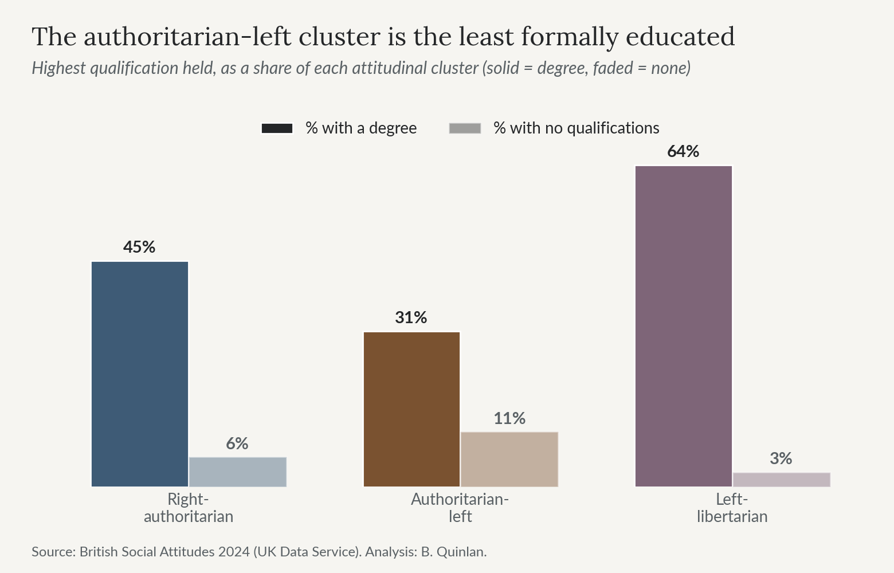

# One Coalition, Two Electorates

### A short, code-free tour of what the data showed about Reform UK's voters

*Bradley Quinlan, 2026*

*This is the plain-language version of the project. The full write-up, with all the code, is in
the [notebook](../notebook/) and rendered for reading in [`report.html`](report.html). Every chart
here is a statistic computed from survey data—no individual respondents are shown.*

---

## The question

There's a comfortable shorthand in political commentary: "the Reform voter." I wanted to know
whether that single label hides more than one kind of person.

Put precisely, the question the project sets out to answer is this: **is Reform UK's electoral
coalition attitudinally unified, or does it contain a substantial cross-pressured subgroup whose
economic and social attitudes sit in tension with the party's own positions?** That phrasing matters.
It asks about structure inside the electorate, not about who will win anything, and it can be
answered with attitudes alone—without ever showing the model who voted for whom.

The starting idea is **cross-pressure**, a classic in electoral sociology. Lazarsfeld, Berelson and
Gaudet (1944) described voters pulled in different directions by conflicting social influences, who
resolve the tension by deciding late, holding their party loosely, or voting in ways that sit oddly
with their stated views. Hillygus and Shields (2008) recast it around issues: a voter whose position
on something salient diverges from their party's platform is more persuadable and more likely to
carry internally inconsistent bundles of attitudes. That second version is the one this project
tests.

## The argument I'm walking into

This is a live disagreement, and it's worth knowing the shape of it before looking at any results.

**Ford and Goodwin (2014)** brought cross-pressure to the British radical right directly, describing
UKIP's base—Reform's predecessor—as "left behind": older, working-class, economically insecure
voters who pair socially authoritarian attitudes with a real attachment to state support. It is the
thesis most people are repeating, usually without knowing they're repeating it.

**Evans and Mellon (2016)** contest it. Drawing on long-run panel data, they argue the radical-right
vote is better explained by *composition*—which voters defected, and in what order—than by a stable
economically-left core. Their objection is partly about evidence: much of the left-behind case rests
on aggregate patterns, and aggregate patterns can mislead about individuals.

**Norris and Inglehart (2019)** push in a third direction entirely. Their *cultural backlash* thesis
treats radical-right support as a reaction against progressive value change rather than material
grievance—values, not economics.

**Sobolewska and Ford (2020)**, in *Brexitland*, then reframe the original thesis from the inside,
moving its centre of gravity from economic left-behindness toward an identity divide driven by the
expansion of higher education. Education, on this account, is not a proxy for income; it is where
the values themselves are formed.

And the most recent descriptive baseline, NatCen's *British Social Attitudes 43: Who Supports
Reform?* (2026), profiles Reform's voters using the same survey series—but describes them without
clustering them, and doesn't take up the cross-pressure question at all.

So there is a well-developed argument about what this electorate *is*, conducted largely with
descriptive statistics and panel data. What nobody had done was ask an unsupervised model whether the
tension shows up inside Reform's own voters, without telling it what to look for. That's the gap this
project works in—and because the four positions above make different predictions, the data can
actually speak to them rather than just illustrating one.

## Where the data made me change course

Three honest moments shaped the result, and I've left them visible rather than tidied away.

**A plan the data wouldn't support.** I'd intended to study LGB Reform voters and their own equality
attitudes. But the survey's split-ballot design meant that of 336 Reform voters, only fifteen
identified as non-heterosexual, and just two of those were asked the relevant questions. Two is not
a finding. So I reframed the question from *identity-versus-vote* to *attitude-versus-attitude*—the
stronger question anyway.

**A judgement call over a metric.** After using PCA to find the main attitudinal axes, I clustered
the voters. The usual metric (the silhouette score) was highest at two clusters—but two clusters
lumped almost all Reform voters together and hid exactly what I was looking for. I chose three,
trading a little statistical neatness (0.392 to 0.358) for a result that answered the question. As
it happens, the two-cluster optimum *is* the two-electorates story; the third cluster is just a small
left-libertarian fringe.

**A method that disagreed with itself.** A first autoencoder seemed to confirm the clusters
neatly—until I noticed its result leaned on a geometric quirk. A second one, built to remove the
quirk, disagreed. Instead of quietly keeping the flattering number, I followed the disagreement, and
it led to the most useful part of the analysis: pinning down exactly how much to trust the split.

## The two axes the electorate divides on

Before the clusters, the axes. Principal component analysis on five attitude scales returns two
components holding about three-quarters of the variance. The first is the familiar left–right
dimension that fuses social and economic attitudes. The second is the interesting one: it separates
people who are *authoritarian and economically left at the same time* from their libertarian-right
opposites. That second axis is what the whole project is built around, and it exists in the data
before any clustering is done.

## The finding: two electorates, not one

Clustered on political attitudes alone, with no sight of vote choice, Reform's voters split almost
in half:

- **55%** sit in a conventional **right-authoritarian** group.
- **41%** sit in an **authoritarian-left** group—socially hardline, but economically left.
- **4%** fall in a small left-libertarian cluster that is otherwise almost Reform-free.

Those are shares of the 329 Reform voters in the 2024 British Social Attitudes Survey, located inside
a sample of 3,966 respondents.

That second group is the cross-pressured one. Their economic instincts sit in real tension with the
party they voted for—Reform campaigned in 2024 on tax cuts it costed itself at nearly £90bn a year,
a figure the IFS reported and judged an underestimate (Emmerson, Joyce and Miller, 2024).

## What kind of group is it?

"Economically left" undersells what's going on, and getting this right took some care.

This group is pro-redistribution *and* about as sceptical of welfare claimants as the conventional
right-authoritarian group *and* nearly as anti-immigration (around four in five, on the relevant
split-ballot items, rate immigration bad for the economy). It decouples two things most voters keep
welded together: taking from the better-off, which it supports, and sympathy for claimants, which it
doesn't. Redistribution aimed at an implied in-group, held alongside hostility to an out-group's
claim on the same welfare state, is what political scientists call **welfare chauvinism** (Andersen
and Bjørklund, 1990)—a more precise description, and a less paradoxical one, than "a left-wing
electorate inside a right-wing party."

What makes the "left-behind" label concrete is **income and education**. This group's Reform voters
sit a full household-income band below the conventional-right group's, and they are much the least
qualified of the three—31% hold a degree, against 45% and 64%. That education gap holds even after
adjusting for social class and household income, which is what *Brexitland* predicts and what a
purely economic account does not.

I had expected benefit receipt to do that work, and checked it properly rather than assuming. It
doesn't. The survey's benefit question counts the state pension, winter fuel payments and child
benefit, so for an old-skewing electorate it partly measures age: above 65 the two Reform groups are
indistinguishable. Benefit receipt ended up the weakest claim in the project, and saying so is more
useful than leaning on it.

## Is it real—and is it old?

**How much to trust it.** The autoencoder that disagreed taught me where the uncertainty really
lives. The split barely moves if I drop the weakest variable, cluster on the full data instead of a
2-D summary, or resample the respondents—a Reform voter placed in the left-behind group stays there
across resamples 98% of the time. Hierarchical clustering agrees strongly with the main method, and a
decision tree, coming at the problem backwards, finds the same dominant attitude and—tellingly—
struggles to pick out the cross-pressured group, exactly as a genuinely conflicted group should. The
one thing that *can* redraw the split is a radically different way of compressing the data, and even
then only at the soft border between the two Reform groups, never in whether the left-behind group
exists.

**How old it is.** Projecting 2014 UKIP identifiers into the same model, they fall into the
"left-behind" cluster *even more heavily* than 2024 Reform voters—59% against 41%, a gap well beyond
chance. The pattern predates Reform by a decade.

But the raw share is the wrong quantity for the sharper question, because the whole population's
authoritarian-left share also shrank over the decade. Measured against each year's own population,
the left-behind group is just as over-represented in 2024 as in 2014, while the conventional-right
group flips from *under*-represented to *over*-represented. Reform's coalition didn't move away from
its left-behind core; it added a conventional-right layer on top of one that was already there. That
is the distinction *Brexitland* draws between an electorate changing its mind and a coalition being
recomposed—and the pattern here fits the second.

## What I'm claiming—and what I'm not

The claims are deliberately **descriptive**, not predictive. These are structural patterns in
attitudes, not turnout forecasts, and nothing here says how any particular constituency will vote.

Four limits are worth stating plainly, because a careful reader will reach for them.

**The subgroups are small.** 329 Reform voters, and the split-ballot design confines the immigration
and LGB items to roughly a quarter of the sample. Those figures profile the clusters; they don't
define them, and they're reported with their sample sizes throughout.

**The clustering is unweighted.** Fitting survey weights inside an unsupervised pipeline is
non-standard, so the percentages describe the analytic sample rather than the population. As a check,
reweighting the final split to the survey's published weights moves it only to 52/44/4 against
55/41/4—so the two-electorates finding isn't an artefact of that.

**Benefit reliance is the weakest claim in the project**, for the reasons above, and the left-behind
reading rests on income and education instead.

**A decade apart is not a panel.** Two independent cross-sections can show that the profile is
durable and that the coalition's composition shifted. They cannot show that any individual voter
changed their mind. Separating conversion from composition at the individual level would need panel
data such as the British Election Study—which is precisely the evidence Evans and Mellon bring to the
original debate, and precisely what a repeated cross-section cannot settle.

What the analysis does establish is structure and its persistence—across linear and non-linear
methods, supervised and unsupervised, and across ten years of data. A single "Reform voter" label
hides two quite different electorates, and the cross-pressured half is real, robust, and at least a
decade old.

---

*Data: British Social Attitudes Survey 2024 (UK Data Service SN 9478) and 2014 (SN 7809), NatCen
Social Research; English Indices of Deprivation 2019 (MHCLG); 2025 Local Elections Handbook (House
of Commons Library). The raw survey microdata is licence-restricted and not included in this
repository—see [`data/README.md`](../data/README.md).*

## Works cited

Andersen, J.G. and Bjørklund, T. (1990) 'Structural Changes and New Cleavages: the Progress Parties
in Denmark and Norway', *Acta Sociologica*, 33(3), pp. 195–217.

Emmerson, C., Joyce, R. and Miller, H. (2024) *Reform UK manifesto: a reaction*. London: Institute
for Fiscal Studies. Available at: <https://ifs.org.uk/articles/reform-uk-manifesto-reaction>
(Accessed: 6 August 2026).

Evans, G. and Mellon, J. (2016) 'Working Class Votes and Conservative Losses: Solving the UKIP
Puzzle', *Parliamentary Affairs*, 69(2), pp. 464–479.

Ford, R. and Goodwin, M.J. (2014) *Revolt on the Right: Explaining Support for the Radical Right in
Britain*. Abingdon: Routledge.

Hillygus, D.S. and Shields, T.G. (2008) *The Persuadable Voter: Wedge Issues in Presidential
Campaigns*. Princeton: Princeton University Press.

Lazarsfeld, P.F., Berelson, B. and Gaudet, H. (1944) *The People's Choice: How the Voter Makes Up His
Mind in a Presidential Campaign*. New York: Columbia University Press.

NatCen Social Research (2026) *British Social Attitudes 43: Who Supports Reform?* London: NatCen
Social Research.

Norris, P. and Inglehart, R. (2019) *Cultural Backlash: Trump, Brexit, and Authoritarian Populism*.
Cambridge: Cambridge University Press.

Sobolewska, M. and Ford, R. (2020) *Brexitland: Identity, Diversity and the Reshaping of British
Politics*. Cambridge: Cambridge University Press.

The full reference list is in [`report.html`](report.html).
